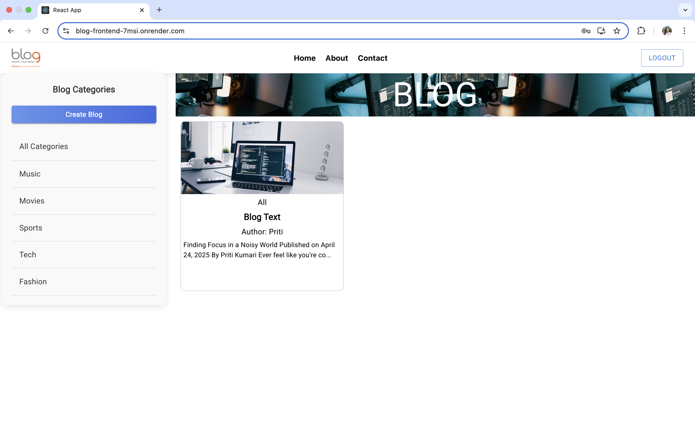
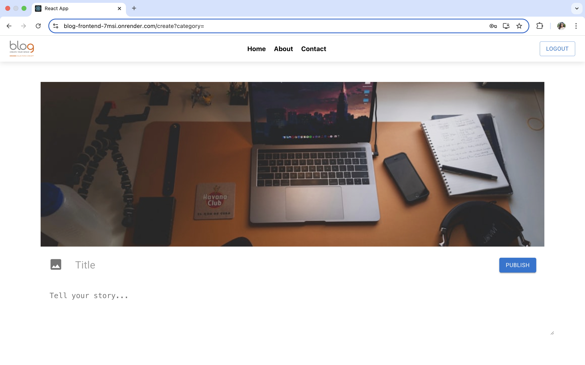
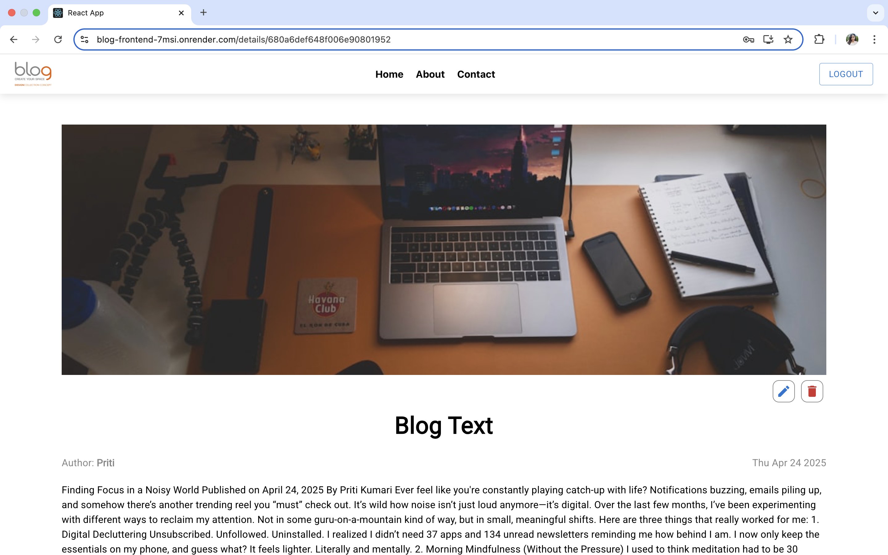

📝 MERN Blog Website
A fully functional Blog Website built using the MERN Stack (MongoDB, Express.js, React.js, Node.js).
Users can sign up, login, create blogs, view blogs, and read details.

🚀 Deployed Link: https://blog-frontend-7msi.onrender.com

🎥 Loom Video Walkthrough: https://www.loom.com/share/ec8d825861eb45e49e53263718d25da3?sid=185277a6-8bc8-4e33-9ff6-a8e22352cb90

📸 Screenshots

🔐 Login Page
### 🔐 Login Page

📝 Signup Page
### 📝 Signup Page

🏠 Home Page (All Blogs)
### 🏠 Home Page

✍️ Create Blog Page
### ✍️ Create Blog Page

📖 Blog Details Page
### 📖 Blog Details Page

🛠️ Tech Stack
Frontend: React.js, Axios, React Router DOM

Backend: Node.js, Express.js

Database: MongoDB Atlas

Authentication: JWT (JSON Web Tokens)

Hosting:

Frontend → Render / Vercel / Netlify

Backend → Render

Database → MongoDB Atlas

🚀 Features
User Signup and Login

JWT Authentication and Protected Routes

Create, View, and Read Blog Posts

User-specific blogs (only logged-in users can create)

Fully Responsive Design ✨

🛠️ Installation Steps
Clone the repository:

bash
Copy
Edit
git clone https://github.com/your-username/mern-blog-website.git
cd mern-blog-website
Install frontend dependencies:

bash
Copy
Edit
cd client
npm install
Install backend dependencies:

bash
Copy
Edit
cd ../server
npm install
Create a .env file inside the server folder and add:

env
Copy
Edit
PORT=5000
MONGO_URI=your-mongodb-atlas-uri
JWT_SECRET=your-secret-key
Start both frontend and backend:

bash
Copy
Edit
# In server folder
npm run dev

# In client folder
npm start
🌐 Deployment
Frontend Deployed at: your-frontend-deploy-link

Backend Deployed at: your-backend-deploy-link

Frontend connected to backend using:

javascript
Copy
Edit
const API = axios.create({
  baseURL: 'https://your-backend-service.onrender.com',
});
📋 Folder Structure
bash
Copy
Edit
mern-blog-website/
│
├── client/    # React Frontend
│   ├── src/
│   ├── public/
│   ├── package.json
│
├── server/    # Node.js Backend
│   ├── models/
│   ├── routes/
│   ├── controllers/
│   ├── middlewares/
│   ├── index.js
│   ├── package.json
│
└── README.md
🤝 Contributing
Pull requests are welcome!
Feel free to open an issue or submit a PR if you want to improve it.

📞 Contact
Priti Kumari
📧 [your-email@example.com]
🌐 LinkedIn Profile

If you liked this project, don't forget to give it a ⭐ on GitHub!

